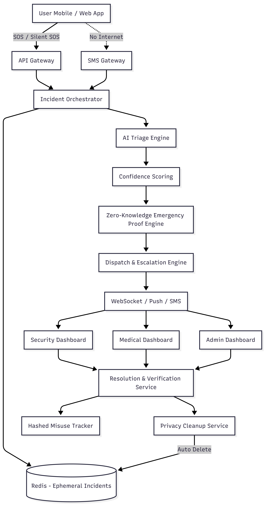

# TEAM FANTASTICFOUR

# 🚨 Privacy‑Preserving AI‑Driven SOS Campus Safety Platform

A privacy‑first SOS and emergency response system for educational campuses that enables rapid incident reporting and intelligent response without tracking users or storing personal data.

## Problem Statement

Educational campuses face delays and inefficiencies in responding to emergencies such as medical incidents, harassment, and accidents. Existing solutions often rely on manual reporting, continuous user tracking, and storage of personal data, raising privacy and trust concerns.

## Proposed Solution

We propose a software‑only, privacy‑preserving SOS platform that enables users to trigger emergency alerts, uses AI to assess urgency, and routes incidents to appropriate campus departments — without storing personal identity or tracking users continuously.

## Key Features

- SOS and Silent SOS for emergencies
- AI‑assisted incident classification and severity assessment
- Role‑based dispatch to security, medical, and admin teams
- Privacy‑by‑design architecture with no user profiles
- Automatic deletion of sensitive data after resolution
- Ethical handling of false alarms
- Works in low‑internet environments

## Privacy‑by‑Design Principles

- No user accounts or personal identifiers
- No continuous GPS or movement tracking
- No storage of phone numbers, MAC addresses, or IP addresses
- Ephemeral incident‑based identifiers
- Automatic data deletion enforced by the system

## System Architecture

The platform follows an incident‑centric architecture where incidents — not users — are tracked. AI assists in triage and escalation, while privacy is enforced through automatic cleanup services.

## High‑Level Workflow

1. User triggers SOS or Silent SOS
2. A temporary incident ID is created
3. AI classifies the incident and estimates severity
4. Incident is routed to responsible departments
5. Responders acknowledge and resolve the incident
6. All sensitive data is automatically deleted

## Novelty & Innovation

- Incident‑centric safety model instead of user tracking
- Zero‑Knowledge Emergency Verification for trust without identity
- AI used for escalation decisions, not surveillance
- Privacy enforced by system architecture, not policy

## SDG Alignment

- SDG 3: Good Health & Well‑Being
- SDG 5: Gender Equality
- SDG 16: Peace, Justice & Strong Institutions

## Future Scope

- Mobile app integration
- Advanced AI models for triage
- Inter‑campus emergency federation